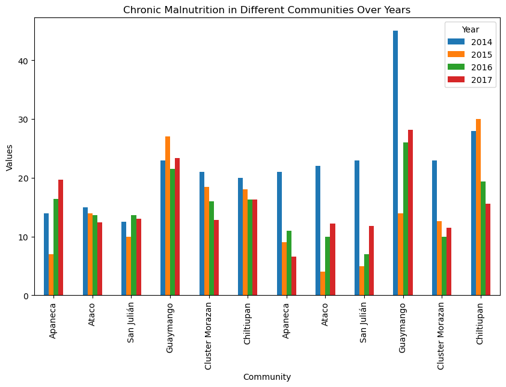

# FUSAL Case Study Analysis

This repository contains data analysis, visualizations, and insights for the FUSAL project, which is part of the **Social Innovation diploma** at the **University for Peace (UPEACE)**. The project was conducted as a requirement for the **Monitoring & Evaluation Fundamentals: Measuring Outcomes & Impact** course, focusing on evaluating malnutrition patterns across different communities and measuring outcomes to assess the impact of interventions.

## Table of Contents
- [Project Overview](#project-overview)
- [Data](#data)
- [Results and Insights](#results-and-insights)
  - [Sample Visualization](#sample-visualization)
  - [Recommendations](#recommendations)
- [License](#license)

## Project Overview

The **FUSAL Case Study** is a core part of the **Social Innovation diploma** at **UPEACE** under the **Monitoring & Evaluation Fundamentals: Measuring Outcomes & Impact** course. It focuses on evaluating malnutrition rates across different regions in El Salvador, analyzing key trends and developing evidence-based insights. The project aims to:

- Detect patterns of malnutrition across specific communities.
- Identify unexpected trends and anomalies.
- Propose actionable recommendations based on data-driven insights.

The analysis was performed using Python and various libraries to process, visualize, and analyze the data.

## Data

The dataset contains records of malnutrition rates from several communities, including Guaymango, Chiltiupan, and Apaneca, covering the period from 2014 to 2017. The data is used to examine longitudinal trends and identify any significant changes over time.

## Results and Insights

Key findings from the analysis include:
- **Guaymango** shows persistently high malnutrition rates with little improvement.
- **Chiltiupan** presents significant fluctuations, with only temporary improvements between 2014 and 2017.
- **Apaneca** and **Ataco** show continuous declines in malnutrition rates, likely due to successful interventions.
  
Further insights and recommendations for future action are detailed in the `analysis_notebook.ipynb`.

### Sample Visualization

### Recommendations
Based on the analysis:
- Further investigation into the interventions in **Guaymango** and **Chiltiupan** is recommended.
- Replication of successful strategies from **Apaneca** and **Ataco** to other communities may help improve malnutrition rates.

## License

This project is licensed under the MIT License. Please refer to the `LICENSE` file for further details.
